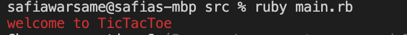
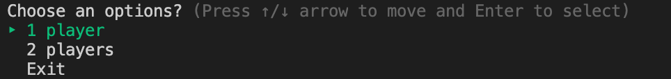
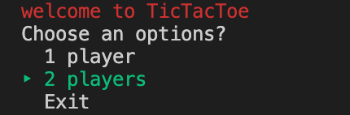
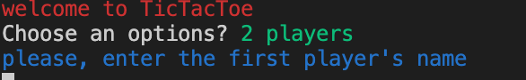
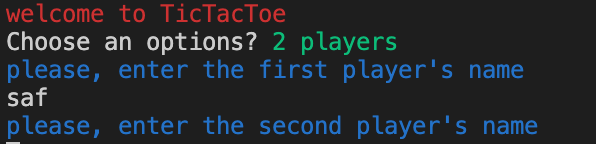
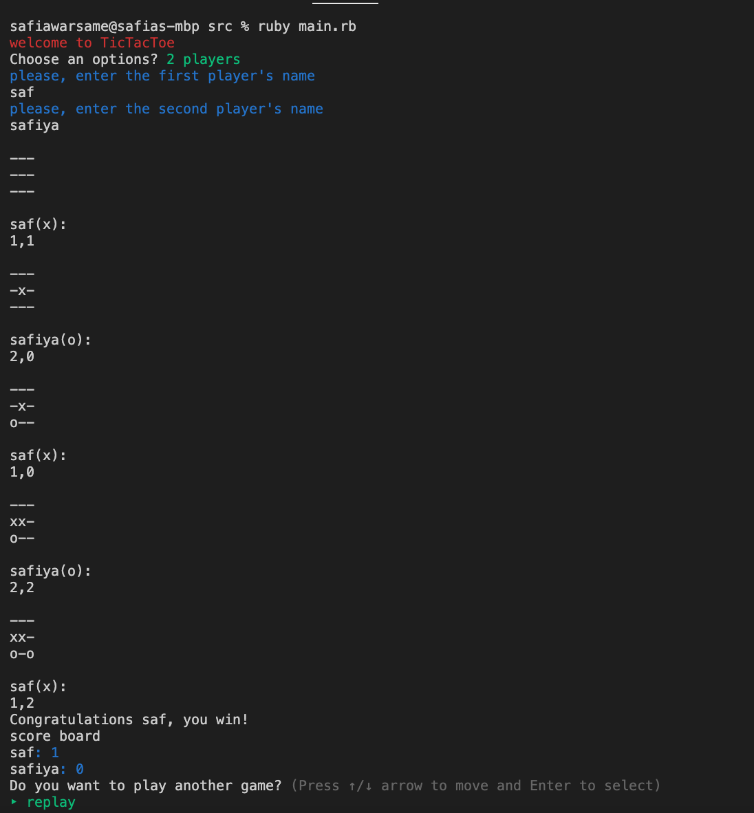
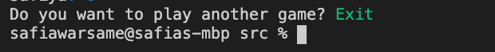

**GitHub Repository Link:**
- https://github.com/safiawarsame/TerminalApp

**Trello Link**
- https://trello.com/b/A3wfwEcQ/terminal-app 

**Software Development Plan**

- **What the Application will do:**
- TicTacToe is a well-known online game that is easy and fun to play.

- **Target Audience:**
- TicTacToe is a very standard game that has no age limit which makes the demographic very wide. Anyone can play from kids to millennials and also anyone who has access to my GitHub link.
- **How To Use the App:**
- To play the game you have to go on terminal and run "ruby manin.rb" 

**Features of the App**

- **1- Welcoming message**
- The welcoming messsage is the first thing that will appear in the application before playing the game begins.

- **2- Choose an option**

- TicTacToe will give you two option. 1 player or 2 players.
- 1 player would have given you an option to play with an API but currently there an error in it.
- 2 players option allows you to play with players. It also allows you to imput player 1 and 2's name. 

- **3- ScoreBoard**
- The scoredboard was created so it can keep count of how many times you've won each game. At the end of each game, there will be a score board.If the player/players keeps playing, the scoreboard will keep accumulating. If the player/players exit and then start a new game the score board will start from 0.

- **Replay/Exit**
- Once the game is finish, it will give you two options. 
- Option one, you either replay the game which it will then gives you another option. 1 player or 2 players.
- Option 2, you exit the game .

**How the user will find out how to use the app**
the app is created in a very simple way. it has instructions and wont be hard to follow.
**How user will interact and use each feature**

- 1- the welcoming message 
- It's the first thing that will pops up as soon as you run ruby main.rb 

- 2- Choose an option
- To choose your options you need to press the up/down arrows to move enter and select
as stated previously in the features.

- 

- lets say i pick 2 players

- 
- must insert player 1 name 
- 

- must insert player 2 name
- 
- To play the game you need to use the right cooridnations or else it won't run. The coordinations are between 0..2. Any number after 2 won't run the game. For exmaple, (1,1) will work but if you type 1,3 it won't run and a message will pop up saying "the coordinations are wrong, try again" and it will then give you a chanve to imsert the right coordinations.

- 

 - if i choose to exit this will pop up 
 - 

**Data Flow Diagram**

**Test runs**

- if ARGV.length > 0
    name1 = ARGV[0]
- elsif ARGV.length ==2
    name2 = ARGV[1]   
end 
- if !name1
 puts "please, enter the first player's name".blue
 name1=STDIN.gets.strip 
end
- if !name2
 puts "please, enter the second player's name".blue
 name2=STDIN.gets.strip 
 end
